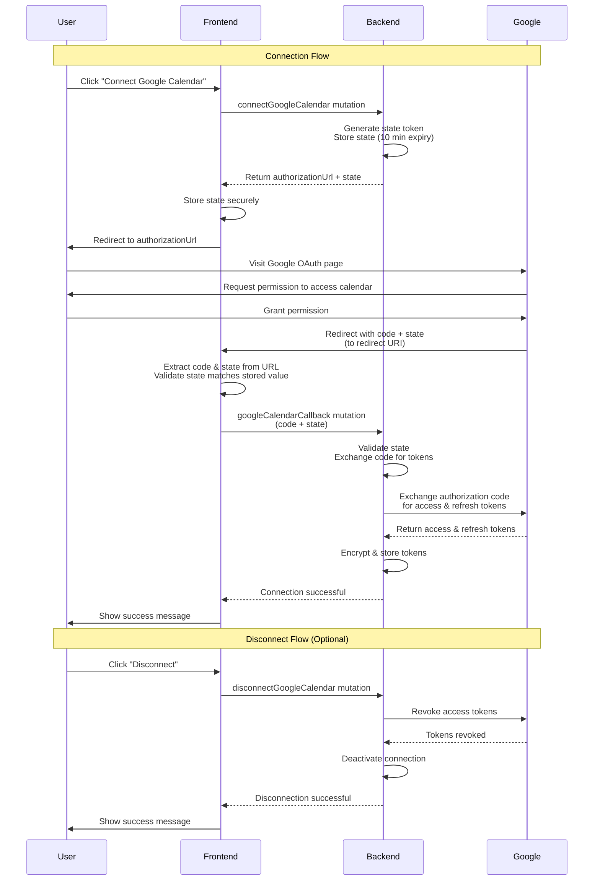

# Google Calendar Authentication GraphQL API Documentation

This document provides comprehensive documentation for the Google Calendar OAuth integration GraphQL API endpoints.

## Table of Contents

- [Overview](#overview)
- [Base URLs](#base-urls)
- [Authentication](#authentication)
- [OAuth Flow Overview](#oauth-flow-overview)
- [Mutations](#mutations)
  - [connectGoogleCalendar](#connectgooglecalendar)
  - [googleCalendarCallback](#googlecalendarcallback)
  - [disconnectGoogleCalendar](#disconnectgooglecalendar)
- [Types](#types)
- [Input Types](#input-types)
- [Response Types](#response-types)
- [Error Handling](#error-handling)
- [Flow Details](#flow-details)
- [Best Practices](#best-practices)

---

## Overview

The Google Calendar integration allows users to connect their Google Calendar account to the Spark API. Once connected, the system can automatically create, update, and delete calendar events in the user's Google Calendar.

**Key Features:**
- OAuth 2.0 authentication flow
- Secure token storage (encrypted)
- Automatic token refresh
- One active connection per user
- CSRF protection via state parameter

**OAuth Scopes:**
- `https://www.googleapis.com/auth/calendar.events` - Full access to create, update, and delete calendar events

---

## Base URLs

The Google Calendar mutations are available on all three GraphQL endpoints:

- **Ambassadors**: `http://localhost:8000/api/v1/graphql/ambassadors`
- **Spark Admin**: `http://localhost:8000/api/v1/graphql/spark`
- **Clients**: `http://localhost:8000/api/v1/graphql/clients`

---

## Authentication

All Google Calendar mutations require authentication. You must include a JWT token in the `Authorization` header:

To obtain a token, use the `tokenAuth` mutation available in your GraphQL schema.

---

## OAuth Flow Overview

The Google Calendar connection uses a standard OAuth 2.0 authorization code flow:

1. **Initiate Connection**: Call `connectGoogleCalendar` mutation to get an authorization URL
2. **User Authorization**: Redirect user to the authorization URL where they grant permissions
3. **Handle Callback**: After user grants permission, Google redirects back with an authorization code
4. **Complete Connection**: Call `googleCalendarCallback` mutation with the code and state to complete the connection
5. **Disconnect** (optional): Use `disconnectGoogleCalendar` to revoke access

### Flow Diagram



**Key Points:**
- The `state` parameter is generated by the backend and must be validated to prevent CSRF attacks
- State tokens expire after 10 minutes
- The authorization code is single-use and short-lived
- Tokens are encrypted before storage in the database
- Only one active connection is allowed per user

---

## Mutations

### connectGoogleCalendar

Initiates the Google Calendar OAuth connection flow. Returns an authorization URL that the user should visit to grant permissions.

**Available for**: Ambassadors, Spark Admin, Clients

**GraphQL Mutation:**
```graphql
mutation ConnectGoogleCalendar($input: ConnectGoogleCalendarInput!) {
  connectGoogleCalendar(input: $input) {
    success
    message
    authorizationUrl
    state
    clientMutationId
  }
}
```

**Variables:**
```json
{
  "input": {
    "clientMutationId": "optional-client-mutation-id"
  }
}
```

**Response Fields:**
- `success` (Boolean): Whether the mutation succeeded
- `message` (String): Human-readable message
- `authorizationUrl` (String, nullable): URL to redirect user to for authorization
- `state` (String, nullable): CSRF protection token (must be stored and used in callback)
- `clientMutationId` (ID, nullable): Echo of the input clientMutationId

**Success Response:**
```json
{
  "data": {
    "connectGoogleCalendar": {
      "success": true,
      "message": "Please visit the authorization URL to connect your Google Calendar.",
      "authorizationUrl": "https://accounts.google.com/o/oauth2/auth?client_id=...&redirect_uri=...&state=...",
      "state": "random-state-token-here",
      "clientMutationId": "optional-client-mutation-id"
    }
  }
}
```

**Error Responses:**

1. **Already Connected:**
```json
{
  "data": {
    "connectGoogleCalendar": {
      "success": false,
      "message": "You already have an active Google Calendar connection. Please disconnect first.",
      "authorizationUrl": null,
      "state": null,
      "clientMutationId": "optional-client-mutation-id"
    }
  }
}
```

2. **Configuration Error:**
```json
{
  "data": {
    "connectGoogleCalendar": {
      "success": false,
      "message": "Failed to initiate Google Calendar connection: <error details>",
      "authorizationUrl": null,
      "state": null,
      "clientMutationId": "optional-client-mutation-id"
    }
  }
}
```

**Flow:**
1. Call the mutation with an optional `clientMutationId`
2. If successful, store the `state` value securely (it's needed for the callback)
3. Redirect the user to the `authorizationUrl` to grant permissions
4. After user grants permission, Google will redirect back to your configured redirect URI with `code` and `state` query parameters

---

### googleCalendarCallback

Completes the Google Calendar OAuth connection by exchanging the authorization code for access tokens.

**Available for**: Ambassadors, Spark Admin, Clients

**GraphQL Mutation:**
```graphql
mutation GoogleCalendarCallback($input: GoogleCalendarCallbackInput!) {
  googleCalendarCallback(input: $input) {
    success
    message
    clientMutationId
  }
}
```

**Variables:**
```json
{
  "input": {
    "code": "authorization-code-from-google",
    "state": "state-token-from-connect-mutation",
    "clientMutationId": "optional-client-mutation-id"
  }
}
```

**Input Fields:**
- `code` (String, required): Authorization code returned by Google after user grants permission
- `state` (String, required): State token from the `connectGoogleCalendar` response (for CSRF protection)
- `clientMutationId` (ID, optional): Optional client mutation identifier

**Response Fields:**
- `success` (Boolean): Whether the mutation succeeded
- `message` (String): Human-readable message
- `clientMutationId` (ID, nullable): Echo of the input clientMutationId

**Success Response:**
```json
{
  "data": {
    "googleCalendarCallback": {
      "success": true,
      "message": "Google Calendar connected successfully.",
      "clientMutationId": "optional-client-mutation-id"
    }
  }
}
```

**Error Responses:**

1. **Invalid State:**
```json
{
  "data": {
    "googleCalendarCallback": {
      "success": false,
      "message": "Invalid state parameter. Please try connecting again.",
      "clientMutationId": "optional-client-mutation-id"
    }
  }
}
```

2. **Token Exchange Error:**
```json
{
  "data": {
    "googleCalendarCallback": {
      "success": false,
      "message": "Failed to connect Google Calendar: <error details>",
      "clientMutationId": "optional-client-mutation-id"
    }
  }
}
```

**Flow:**
1. After user grants permission, Google redirects to your configured redirect URI
2. Extract the `code` and `state` parameters from the URL query string
3. Retrieve the stored `state` value from the `connectGoogleCalendar` response
4. Validate that the `state` from the URL matches the stored `state` (CSRF protection)
5. Call this mutation with the `code` and `state` from the URL
6. The backend exchanges the authorization code for access tokens and stores them securely
7. If successful, the Google Calendar connection is now active

---

### disconnectGoogleCalendar

Disconnects the Google Calendar connection by revoking access tokens and deactivating the connection.

**Available for**: Ambassadors, Spark Admin, Clients

**GraphQL Mutation:**
```graphql
mutation DisconnectGoogleCalendar($input: DisconnectGoogleCalendarInput!) {
  disconnectGoogleCalendar(input: $input) {
    success
    message
    clientMutationId
  }
}
```

**Variables:**
```json
{
  "input": {
    "clientMutationId": "optional-client-mutation-id"
  }
}
```

**Response Fields:**
- `success` (Boolean): Whether the mutation succeeded
- `message` (String): Human-readable message
- `clientMutationId` (ID, nullable): Echo of the input clientMutationId

**Success Response:**
```json
{
  "data": {
    "disconnectGoogleCalendar": {
      "success": true,
      "message": "Google Calendar disconnected successfully.",
      "clientMutationId": "optional-client-mutation-id"
    }
  }
}
```

**Error Responses:**

1. **No Active Connection:**
```json
{
  "data": {
    "disconnectGoogleCalendar": {
      "success": false,
      "message": "No active Google Calendar connection found.",
      "clientMutationId": "optional-client-mutation-id"
    }
  }
}
```

2. **Disconnect Error:**
```json
{
  "data": {
    "disconnectGoogleCalendar": {
      "success": false,
      "message": "Failed to disconnect Google Calendar: <error details>",
      "clientMutationId": "optional-client-mutation-id"
    }
  }
}
```

**Flow:**
1. Call the mutation with an optional `clientMutationId`
2. The backend revokes the access tokens with Google
3. The connection is deactivated in the database
4. User can now reconnect if needed

---

## Types

### ConnectGoogleCalendarResponse

Response type for the `connectGoogleCalendar` mutation.

```graphql
type ConnectGoogleCalendarResponse {
  success: Boolean!
  message: String!
  authorizationUrl: String
  state: String
  clientMutationId: ID
}
```

### GoogleCalendarCallbackResponse

Response type for the `googleCalendarCallback` mutation.

```graphql
type GoogleCalendarCallbackResponse {
  success: Boolean!
  message: String!
  clientMutationId: ID
}
```

### DisconnectGoogleCalendarResponse

Response type for the `disconnectGoogleCalendar` mutation.

```graphql
type DisconnectGoogleCalendarResponse {
  success: Boolean!
  message: String!
  clientMutationId: ID
}
```

---

## Input Types

### ConnectGoogleCalendarInput

Input type for the `connectGoogleCalendar` mutation.

```graphql
input ConnectGoogleCalendarInput {
  clientMutationId: ID
}
```

### GoogleCalendarCallbackInput

Input type for the `googleCalendarCallback` mutation.

```graphql
input GoogleCalendarCallbackInput {
  code: String!
  state: String!
  clientMutationId: ID
}
```

### DisconnectGoogleCalendarInput

Input type for the `disconnectGoogleCalendar` mutation.

```graphql
input DisconnectGoogleCalendarInput {
  clientMutationId: ID
}
```

---

## Error Handling

### Common Error Scenarios

1. **Invalid State Parameter**
   - **Cause**: State token doesn't match or has expired (10-minute timeout)
   - **Solution**: Re-initiate the connection flow

2. **Already Connected**
   - **Cause**: User already has an active Google Calendar connection
   - **Solution**: Disconnect existing connection first, then reconnect

3. **Token Exchange Failure**
   - **Cause**: Invalid authorization code or network error
   - **Solution**: Re-initiate the connection flow

4. **No Active Connection**
   - **Cause**: Attempting to disconnect when no connection exists
   - **Solution**: Check connection status before attempting disconnect

### Error Response Format

All mutations return errors in the response data with `success: false`:

```json
{
  "data": {
    "mutationName": {
      "success": false,
      "message": "Error message describing what went wrong",
      "clientMutationId": "optional-id"
    }
  }
}
```

GraphQL execution errors (network, syntax, etc.) are returned in the `errors` array:

```json
{
  "errors": [
    {
      "message": "Error message",
      "locations": [{"line": 2, "column": 3}],
      "path": ["mutationName"]
    }
  ]
}
```

---

## Flow Details

### Step-by-Step OAuth Flow

1. **User Initiates Connection**
   - Frontend calls `connectGoogleCalendar` mutation
   - Backend generates a unique `state` token and stores it (valid for 10 minutes)
   - Backend returns `authorizationUrl` and `state`

2. **Store State Securely**
   - Frontend must store the `state` value securely (e.g., in session storage or memory)
   - This `state` will be needed to validate the callback

3. **User Authorization**
   - Frontend redirects user to the `authorizationUrl`
   - User logs in to Google (if not already) and grants calendar permissions
   - Google redirects back to your configured redirect URI

4. **Handle OAuth Callback**
   - Google redirects to your redirect URI with `code` and `state` as query parameters
   - Frontend extracts these from the URL
   - Frontend validates that the `state` from the URL matches the stored `state`
   - If validation fails, abort the flow (possible CSRF attack)

5. **Complete Connection**
   - Frontend calls `googleCalendarCallback` mutation with `code` and `state`
   - Backend validates the `state` matches the stored value
   - Backend exchanges the authorization `code` for access and refresh tokens
   - Backend stores encrypted tokens in the database
   - Connection is now active

6. **Disconnect (Optional)**
   - Frontend calls `disconnectGoogleCalendar` mutation
   - Backend revokes tokens with Google
   - Backend deactivates the connection
   - User can reconnect if needed

### State Parameter Security

The `state` parameter is critical for CSRF protection:
- Generated by the backend as a cryptographically secure random token
- Stored server-side with the user ID (valid for 10 minutes)
- Must be validated on callback to ensure the request originated from your application
- Should be stored securely on the frontend and cleared after use

### Redirect URI Configuration

The OAuth redirect URI must be:
- Configured in Google Cloud Console for your OAuth client
- Matched exactly in backend settings (`GOOGLE_OAUTH_REDIRECT_URI`)
- A page that can extract `code` and `state` from URL query parameters

Example redirect URI format:
```
https://yourdomain.com/auth/google-calendar/callback
```

When Google redirects, the URL will look like:
```
https://yourdomain.com/auth/google-calendar/callback?code=4/0A...&state=random-state-token
```

---

## Best Practices

### Security

1. **Always validate the state parameter** - This prevents CSRF attacks. The state from the callback URL must match the state returned by `connectGoogleCalendar`
2. **Store state securely** - Store the state value securely on the frontend (e.g., session storage) and clear it after use
3. **Use HTTPS** - Always use HTTPS in production for OAuth flows
4. **Handle errors gracefully** - Don't expose sensitive error details to users
5. **State expiration** - State tokens expire after 10 minutes. If the callback takes longer, re-initiate the connection

### User Experience

1. **Show loading states** - Indicate when operations are in progress
2. **Provide clear error messages** - Help users understand what went wrong based on the `message` field in responses
3. **Handle redirects smoothly** - Clean up URL parameters after OAuth callback to provide a clean user experience
4. **Check connection status** - Query connection status before showing connect/disconnect options

### Implementation Considerations

1. **State storage** - Store the state value in a way that persists across the OAuth redirect (e.g., session storage)
2. **Clear state after use** - Remove stored state after successful callback or on error
3. **Handle edge cases** - User closes browser during OAuth, network errors, expired states, etc.
4. **Test error scenarios** - Test invalid states, expired tokens, already connected errors, etc.
5. **Redirect URI handling** - Ensure your redirect URI page can extract `code` and `state` from query parameters
